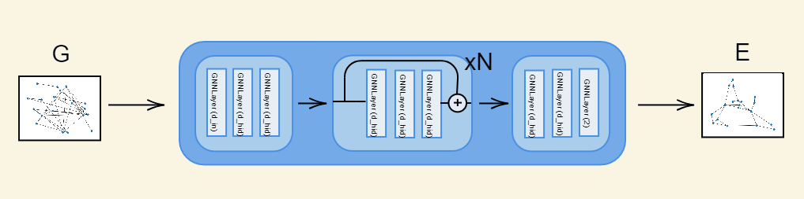
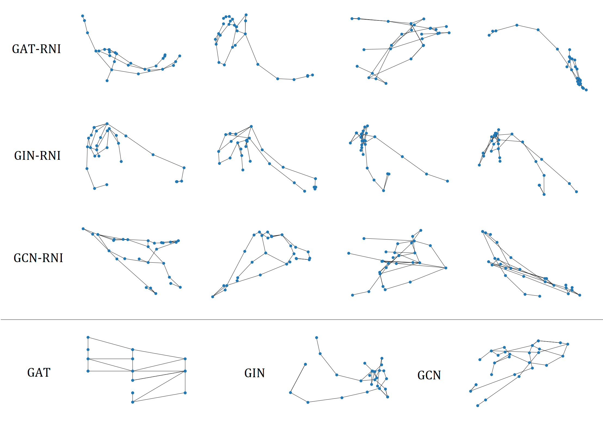
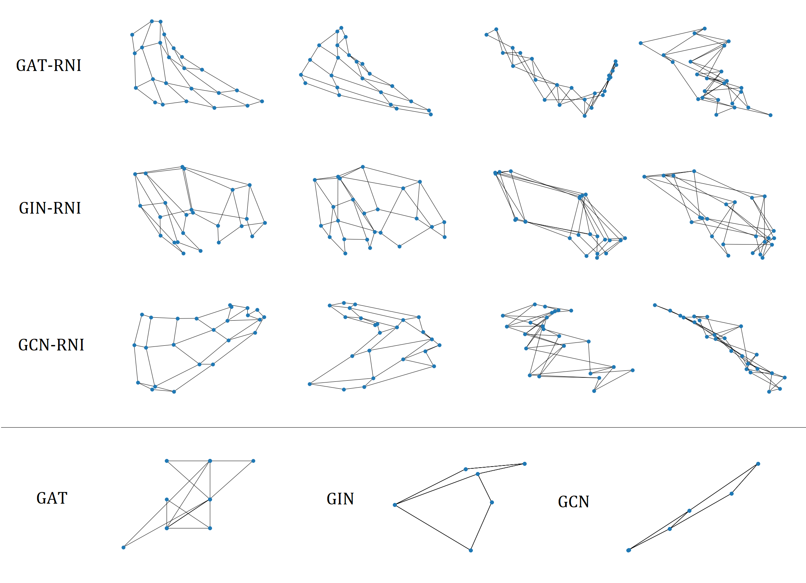
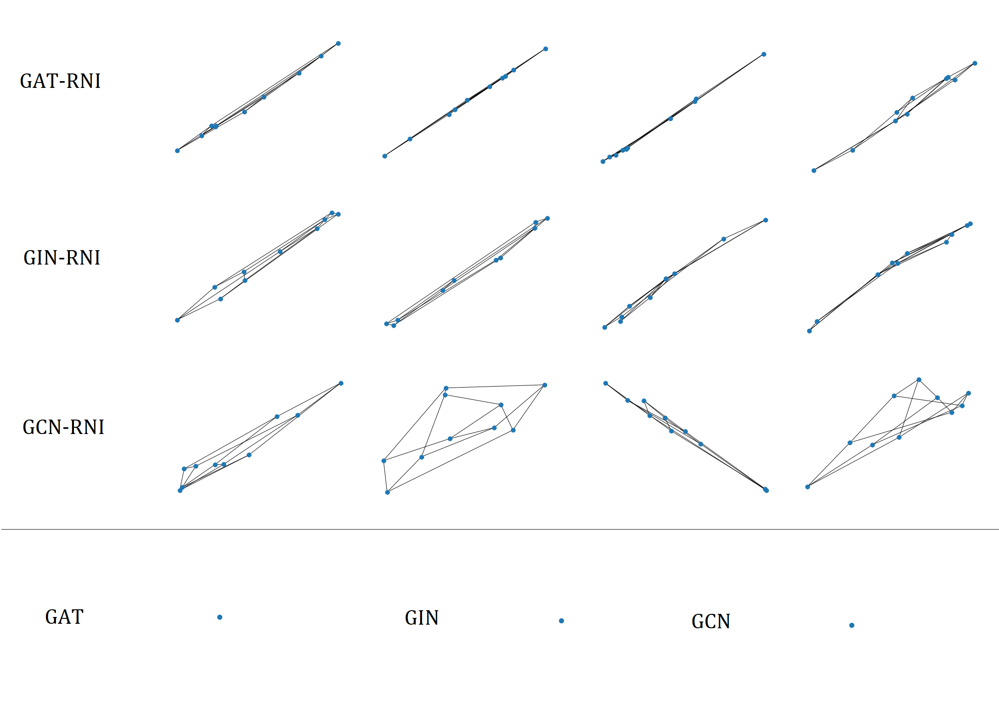

# Can GNNs help us determine the crossing number of a graph?

## Model architecture

## Results

For each of the trained models, the two best (with respect to the crossing number) and two worst (out of 1000 generated drawings) embeddings are presented below.

### Selected graph from Rome dataset

### 4x6 Grid

### Petersen's Graph

